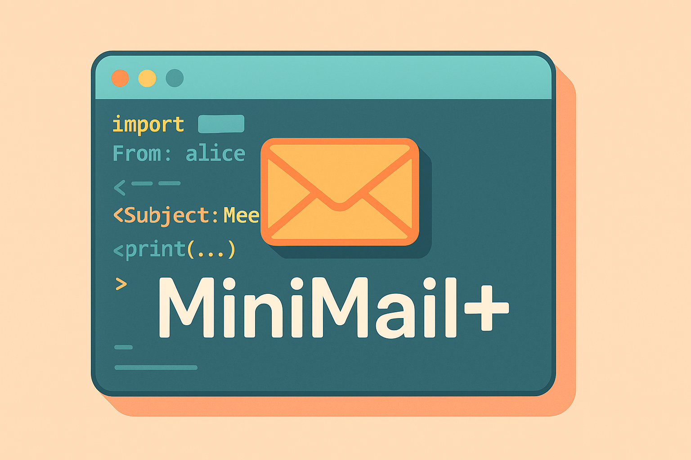

# MiniMail+
<p align="center">
  
</p>
A fully functional, text-based **email client simulator** built with pure Python.  
This project simulates essential email features like sending, receiving, saving drafts, and managing user accounts — all in the terminal.

---

## Features

- **User Authentication**
  - Register new accounts
  - Login/logout
  - Change password
- **Inbox Management**
  - View inbox with unread/read status
  - Delete emails
  - Keyword search in subject/body
- **Composing Emails**
  - Send to one or more recipients (group send)
  - Save as draft for later editing
- **Draft Management**
  - View/edit/send/delete drafts
- **Sent Mailbox**
  - View all sent emails with timestamp and recipient list
- **Persistent Storage**
  - All users and emails are saved to local JSON files

---

## Project Structure

```
.
├── email_client.py        # Main application file
├── users.json             # Auto-generated user credentials (username-password)
└── inboxes.json           # Auto-generated inbox data (inbox, drafts, sent)
```

---

## Getting Started

### Prerequisites

- Python 3.x

### Run the Application

```bash
python3 email_client.py
```

---

## Terminal UI Example

```
============================================================
                      Welcome to MiniMail+                  
============================================================

Main Menu
1. Login
2. Register New User
3. Exit
------------------------------------------------------------
Enter choice (1-3): 
```

---

## Example Usage

### 1. Register a User

```
Choose a username: alice
Choose a password: secret123
User 'alice' registered successfully!
```

### 2. Send Email to Multiple Users

```
Recipients (comma separated): bob, carol
Subject: Meeting Reminder
Message:
Don't forget our 10AM meeting.
Send now or save as draft? (send/draft): send
Email sent to: bob, carol
```

### 3. View Inbox

```
[0] [NEW] From: alice | Time: 2025-05-13T14:30:00
Subject: Meeting Reminder
Message:
Don't forget our 10AM meeting.
```

---

## Libraries Used

- Python 3 (Standard Library only)
  - `json` for data persistence
  - `os` for file handling
  - `datetime` for timestamping emails
  - No external dependencies required

---

## Notes

- This is a **terminal-based simulation**. It does not send real emails.
- For learning and prototyping purposes (no encryption or password hashing).
- Data is stored **locally** in `users.json` and `inboxes.json`.

---

## License

This project is open-source and free to use under the MIT License.